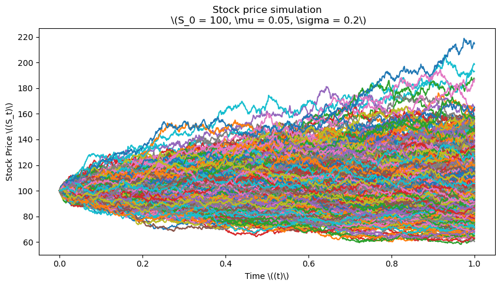
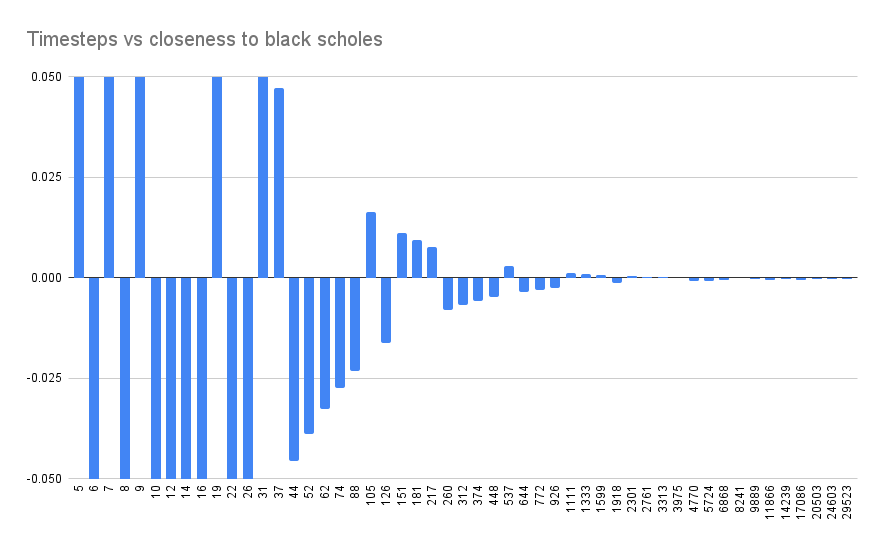

# Options Pricing Models

This project contains implementations of various options pricing models in both C++ and Python. The models implemented are:

- Black-Scholes Model
- Monte Carlo Simulation
- Binomial Tree Model

## Black-Scholes Model

The Black-Scholes model is a mathematical model used for pricing options. It assumes the market is efficient, returns are normally distributed, and there are no transaction costs. This is a what I benchmark the other models against.

## Monte Carlo Simulation

Monte Carlo simulations are used to model the probability of different outcomes in a process that cannot easily be predicted due to the intervention of random variables. The way it works is by simulating many geometric brownian motion runs of the underlying stock, then it is just averaging the options value at expiration, and finally discounting to present value. 

*Visualization of the simulated underlying stock*

## Binomial Tree Model

The Binomial options pricing model approach has been widely used since it is able to handle a variety of conditions for which other models cannot easily be applied.

Here is how fast this model convered to black scholes:

